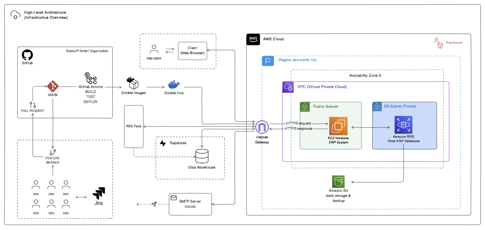
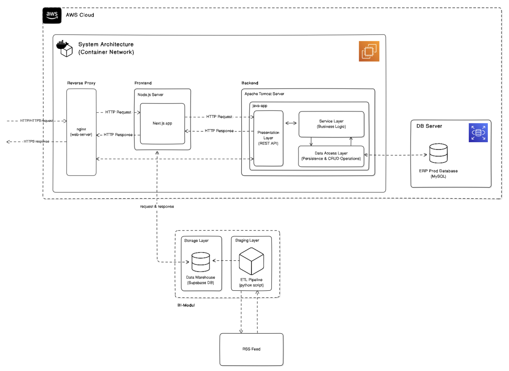

# Architecture of LeanX ERP-System

This document provides a comprehensive overview of the LeanX ERP-System architecture, encompassing both the high-level cloud infrastructure on AWS and the detailed technical system components.

## 1. High-Level Cloud Architecture (Infrastructure Overview)

The LeanX ERP-System is primarily hosted on **Amazon Web Services (AWS)**, within the `eu-north-1b` region. The architecture leverages a Virtual Private Cloud (VPC) for network isolation and security.

[**Diagram of the overall system architecture:** See the attached image for a visual representation of the infrastructure.]

**Description:**

The system utilizes a multi-tiered approach within AWS. A public subnet hosts the EC2 instance (which, as detailed later, runs a container network) running the core ERP System components. This EC2 instance communicates with an Amazon RDS instance residing in a private DB subnet for persistent data storage. Amazon S3 is used for static storage and backups. An Internet Gateway facilitates external access to the EC2 instance. Additionally, the system integrates with external services like Supabase for data warehousing and Ionos for SMTP. The development and deployment process is managed through GitHub Actions, building and deploying Docker images.

## 2. Detailed System Architecture (Container Network within AWS)

The core ERP System within the EC2 instance is implemented as a containerized architecture. The diagram illustrates a clear separation between frontend and backend components, along with supporting layers for data warehousing and storage.

[**Diagram of the detailed system architecture:** See the attached image for a visual representation of the system components and their interactions.]

**Description:**

Incoming HTTP/HTTPS requests are first handled by a **Reverse Proxy (nginx)**. Nginx routes these requests to either the **Frontend (Node.js Server with Next.js app)** for user interface logic or the **Backend (Apache Tomcat Server running a Java app)** for core application logic and data processing. The Backend application follows a layered architecture (Presentation/REST API, Service/Business Logic, Data Access/Persistence), interacting with an **ERP Prod Database (MySQL)** for transactional data. A separate **BI Module**, utilizing a **Data Warehouse (Supabase DB)** and an **ETL Pipeline (Python scripts)**, processes data for dashboards, fetching and parsing an **RSS Feed**.

## 3. Component Integration and Data Flow

The following outlines how the high-level infrastructure supports the detailed system components and the typical data flow:

1.  **Client Access:** Users access the ERP System via web browsers, sending HTTP/HTTPS requests that are routed through the AWS **Internet Gateway** to the **EC2** instance.
2.  **Reverse Proxy Entry:** On the EC2 instance, the **nginx Reverse Proxy** receives these requests.
3.  **Request Routing:**
    * Requests for the user interface are forwarded to the **Frontend (Node.js/Next.js)**.
    * API requests are routed to the **Backend (Tomcat/Java app)**.
4.  **Frontend Processing:** The Frontend serves the web application and interacts with the Backend's **REST API** (Presentation Layer) over HTTP/HTTPS to fetch and update data.
5.  **Backend Processing:**
    * The **Presentation Layer** receives API requests and delegates to the **Service Layer** for business logic execution.
    * The **Service Layer** interacts with the **Data Access Layer** to perform CRUD operations on the **ERP Prod Database (MySQL)** hosted on **Amazon RDS** in a private subnet.
    * The Backend sends responses back to the Frontend (via nginx).
    * The Backend also sends data to the external **Data Warehouse (Supabase DB)** for business intelligence.
6.  **Business Intelligence:**
    * An **ETL Pipeline (Python scripts)** periodically extracts data from the **ERP Prod Database (MySQL)**.
    * This data is transformed and loaded into the **Data Warehouse (Supabase DB)**.
    * The **BI Module** queries the **Data Warehouse** for generating reports and insights, which may be exposed through an **RSS Feed**.
7.  **Development and Deployment:** Developers commit code to **GitHub** via pull requests. A **GitHub Actions** builds **Docker images** of the Frontend and Backend applications and pushes them to Docker Hub. These images are then deployed to the **EC2 instance** and orchestrated via docker-compose. The process is automated as part of the CI/CD-pipeline.

## 4. Technology Stack (Combined View)

* **Cloud Provider:** AWS
* **Compute:** Amazon EC2
* **Containerization:** Docker
* **Reverse Proxy/Web Server:** nginx
* **Frontend Framework:** Node.js, Next.js (React)
* **Backend Language:** Java
* **Backend Application Server:** Apache Tomcat Server
* **Backend Framework/Architecture:** Layered Architecture (Presentation/REST API, Service/Business Logic, Data Access/Persistence)
* **Database (Transactional):** MySQL (Amazon RDS)
* **Data Warehouse (Analytical):** Supabase DB (External Service)
* **ETL Pipeline:** Python scripts
* **CI/CD:** GitHub Actions
* **Version Control:** GitHub
* **Issue Tracking:** Jira (External Service)
* **SMTP Server:** Ionos (External Service)

## 5. Security Considerations (Combined View)

* The application is hosted within an isolated **AWS VPC**.
* The transactional database (**Amazon RDS**) resides in a private subnet, limiting direct internet access.
* External access is managed through the **nginx Reverse Proxy**, which can implement security measures.
* Communication with the frontend is over HTTPS (implied by the diagram).
* Security groups control network traffic at the EC2 and RDS instance levels.
* Development and deployment processes leverage secure practices through **GitHub Actions**.
