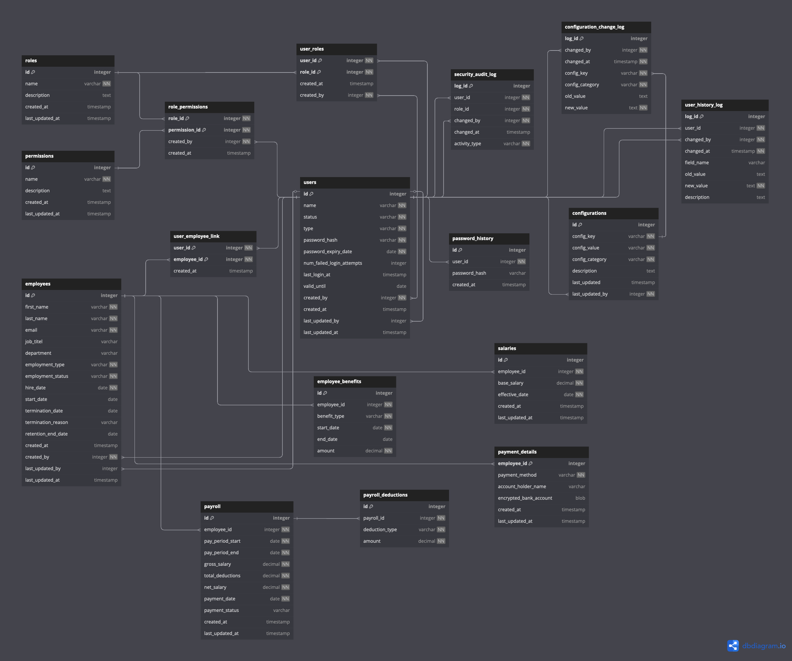

# Database Documentation

## 1. Introduction

**Purpose:** This database stores ... and supports ...

**Scope:** The database includes ...

**Target Audience:** Developers, DB Administrators

## 2. Database Design

**ER-Diagramm**



### Table Definitions

**roles Table**

* **Purpose:** Stores information about roles in the system.
* **Columns:**
    * `id`: INT, PRIMARY KEY, AUTO_INCREMENT
    * `name`: VARCHAR(255), UNIQUE, NOT NULL
    * `description`: TEXT
    * `created_at`: TIMESTAMP, DEFAULT CURRENT_TIMESTAMP
    * `last_updated_at`: TIMESTAMP, DEFAULT CURRENT_TIMESTAMP, ON UPDATE CURRENT_TIMESTAMP
* **SQL Code:**
    ```sql
    CREATE TABLE roles (
        id INT PRIMARY KEY AUTO_INCREMENT,
        name VARCHAR(255) UNIQUE NOT NULL,
        description TEXT,
        created_at TIMESTAMP DEFAULT CURRENT_TIMESTAMP,
        last_updated_at TIMESTAMP DEFAULT CURRENT_TIMESTAMP ON UPDATE CURRENT_TIMESTAMP
    );
    ```

**permissions Table**

* **Purpose:** Stores information about system permissions.
* **Columns:**
    * `id`: INT, PRIMARY KEY, AUTO_INCREMENT
    * `name`: VARCHAR(255), NOT NULL
    * `description`: TEXT
    * `created_at`: TIMESTAMP, DEFAULT CURRENT_TIMESTAMP
    * `last_updated_at`: TIMESTAMP, DEFAULT CURRENT_TIMESTAMP, ON UPDATE CURRENT_TIMESTAMP
* **SQL Code:**
    ```sql
    CREATE TABLE permissions (
        id INT PRIMARY KEY AUTO_INCREMENT,
        name VARCHAR(255) NOT NULL,
        description TEXT,
        created_at TIMESTAMP DEFAULT CURRENT_TIMESTAMP,
        last_updated_at TIMESTAMP DEFAULT CURRENT_TIMESTAMP ON UPDATE CURRENT_TIMESTAMP
    );
    ```

**users Table**

* **Purpose:** Stores information about users.
* **Columns:**
    * `id`: INT, PRIMARY KEY, AUTO_INCREMENT
    * `name`: VARCHAR(50), UNIQUE, NOT NULL
    * `status`: ENUM('ACTIVE', 'LOCKED', 'DEACTIVATED'), NOT NULL, DEFAULT 'ACTIVE'
    * `type`: ENUM('NORMAL', 'ADMIN', 'SYSTEM'), NOT NULL, DEFAULT 'NORMAL'
    * `password_hash`: VARCHAR(255), NOT NULL
    * `password_expiry_date`: DATE, NOT NULL
    * `num_failed_login_attempts`: INT, DEFAULT 0
    * `last_login_at`: TIMESTAMP, DEFAULT NULL
    * `valid_until`: DATE, DEFAULT NULL
    * `created_by`: INT, NOT NULL, DEFAULT 1
    * `created_at`: TIMESTAMP, DEFAULT CURRENT_TIMESTAMP
    * `last_updated_by`: INT, DEFAULT NULL
    * `last_updated_at`: TIMESTAMP, DEFAULT NULL, ON UPDATE CURRENT_TIMESTAMP
* **SQL Code:**
    ```sql
    CREATE TABLE users (
        id INT PRIMARY KEY AUTO_INCREMENT,
        name VARCHAR(50) UNIQUE NOT NULL,
        status ENUM('ACTIVE', 'LOCKED', 'DEACTIVATED') NOT NULL DEFAULT 'ACTIVE',
        type ENUM('NORMAL', 'ADMIN', 'SYSTEM') NOT NULL DEFAULT 'NORMAL',
        password_hash VARCHAR(255) NOT NULL,
        password_expiry_date DATE NOT NULL,
        num_failed_login_attempts INT DEFAULT 0,
        last_login_at TIMESTAMP DEFAULT NULL,
        valid_until DATE DEFAULT NULL,
        created_by INT NOT NULL DEFAULT 1,
        created_at TIMESTAMP DEFAULT CURRENT_TIMESTAMP,
        last_updated_by INT DEFAULT NULL,
        last_updated_at TIMESTAMP DEFAULT NULL ON UPDATE CURRENT_TIMESTAMP,
        FOREIGN KEY (created_by) REFERENCES users(id) ON DELETE RESTRICT,
        FOREIGN KEY (last_updated_by) REFERENCES users(id)
    );
    ```

**role_permissions Table**

* **Purpose:** Stores the mapping of roles and permissions.
* **Columns:**
    * `role_id`: INT, NOT NULL
    * `permission_id`: INT, NOT NULL
    * `created_by`: INT, NOT NULL
    * `created_at`: TIMESTAMP, DEFAULT CURRENT_TIMESTAMP
* **SQL Code:**
    ```sql
    CREATE TABLE role_permissions (
        role_id INT NOT NULL,
        permission_id INT NOT NULL,
        created_by INT NOT NULL,
        created_at TIMESTAMP DEFAULT CURRENT_TIMESTAMP,
        PRIMARY KEY (role_id, permission_id),
        FOREIGN KEY (role_id) REFERENCES roles(id),
        FOREIGN KEY (permission_id) REFERENCES permissions(id),
        FOREIGN KEY (created_by) REFERENCES users(id)
    );
    ```

**user_roles Table**

* **Purpose:** Stores the mapping of users and roles.
* **Columns:**
    * `user_id`: INT, NOT NULL
    * `role_id`: INT, NOT NULL
    * `created_at`: TIMESTAMP, DEFAULT CURRENT_TIMESTAMP
    * `created_by`: INT, NOT NULL
* **SQL Code:**
    ```sql
    CREATE TABLE user_roles (
        user_id INT NOT NULL,
        role_id INT NOT NULL,
        created_at TIMESTAMP DEFAULT CURRENT_TIMESTAMP,
        created_by INT NOT NULL,
        PRIMARY KEY (user_id, role_id),
        FOREIGN KEY (user_id) REFERENCES users(id),
        FOREIGN KEY (role_id) REFERENCES roles(id),
        FOREIGN KEY (created_by) REFERENCES users(id)
    );
    ```

**password_history Table**

* **Purpose:** Stores password history for users.
* **Columns:**
    * `id`: INT, PRIMARY KEY, AUTO_INCREMENT
    * `user_id`: INT, NOT NULL
    * `password_hash`: VARCHAR(255)
    * `created_at`: TIMESTAMP, DEFAULT CURRENT_TIMESTAMP
* **SQL Code:**
    ```sql
    CREATE TABLE password_history (
        id INT AUTO_INCREMENT PRIMARY KEY,
        user_id INT NOT NULL,
        password_hash VARCHAR(255),
        created_at TIMESTAMP DEFAULT CURRENT_TIMESTAMP,
        FOREIGN KEY (user_id) REFERENCES users(id)
    );
    ```

**configurations Table**

* **Purpose:** Stores configuration settings for the system.
* **Columns:**
    * `id`: INT, PRIMARY KEY, AUTO_INCREMENT
    * `key`: VARCHAR(255), UNIQUE, NOT NULL
    * `value`: VARCHAR(255), NOT NULL
    * `category`: ENUM('PASSWORD_SETTINGS', 'EMAIL_SETTINGS', 'SECURITY_SETTINGS', 'SYSTEM_SETTINGS'), NOT NULL
    * `description`: TEXT
    * `last_updated`: TIMESTAMP, DEFAULT CURRENT_TIMESTAMP, ON UPDATE CURRENT_TIMESTAMP
    * `last_updated_by`: INT, NOT NULL
* **SQL Code:**
    ```sql
    CREATE TABLE configurations (
        id INT AUTO_INCREMENT PRIMARY KEY,
        config_key VARCHAR(255) UNIQUE NOT NULL,
        config_value VARCHAR(255) NOT NULL,
        config_category ENUM('PASSWORD_SETTINGS', 'EMAIL_SETTINGS', 'SECURITY_SETTINGS', 'SYSTEM_SETTINGS') NOT NULL,
        description TEXT,
        last_updated TIMESTAMP DEFAULT CURRENT_TIMESTAMP ON UPDATE CURRENT_TIMESTAMP,
        last_updated_by INT NOT NULL,
        FOREIGN KEY (last_updated_by) REFERENCES users(id)
    );
    ```

**security_audit_log Table**

* **Purpose:** Stores security-related audit logs for changes to roles.
* **Columns:**
    * `log_id`: INT, PRIMARY KEY, AUTO_INCREMENT
    * `user_id`: INT, NOT NULL
    * `role_id`: INT, NOT NULL
    * `changed_by`: INT, NOT NULL
    * `changed_at`: TIMESTAMP, DEFAULT CURRENT_TIMESTAMP
    * `activity_type`: ENUM('ROLE_ASSIGNED', 'ROLE_REMOVED'), NOT NULL
* **SQL Code:**
    ```sql
    CREATE TABLE security_audit_log (
        log_id INT PRIMARY KEY AUTO_INCREMENT,
        user_id INT NOT NULL,
        role_id INT NOT NULL,
        changed_by INT NOT NULL,
        changed_at TIMESTAMP DEFAULT CURRENT_TIMESTAMP,
        activity_type ENUM('ROLE_ASSIGNED', 'ROLE_REMOVED') NOT NULL,
        FOREIGN KEY (user_id) REFERENCES users(id),
        FOREIGN KEY (changed_by) REFERENCES users(id)
    );
    ```

**user_history_log Table**

* **Purpose:** Stores historical logs of user data changes.
* **Columns:**
    * `log_id`: INT, PRIMARY KEY, AUTO_INCREMENT
    * `user_id`: INT, NOT NULL
    * `changed_by`: INT, NOT NULL
    * `changed_at`: TIMESTAMP, NOT NULL
    * `field_name`: ENUM('user_status', 'is_verified', 'password_hash', 'num_failed_login_attempts', 'last_login_at', 'valid_until'), DEFAULT NULL
    * `old_value`: TEXT, DEFAULT NULL
    * `new_value`: TEXT, NOT NULL
    * `description`: TEXT, DEFAULT NULL
* **SQL Code:**
    ```sql
    CREATE TABLE user_history_log (
        log_id INT PRIMARY KEY AUTO_INCREMENT,
        user_id INT NOT NULL,
        changed_by INT NOT NULL,
        changed_at TIMESTAMP NOT NULL,
        field_name ENUM('user_status', 'is_verified', 'password_hash', 'num_failed_login_attempts', 'last_login_at', 'valid_until') DEFAULT NULL,
        old_value TEXT DEFAULT NULL,
        new_value TEXT NOT NULL,
        description TEXT DEFAULT NULL,
        FOREIGN KEY (user_id) REFERENCES users(id),
        FOREIGN KEY (changed_by) REFERENCES users(id)
    );
    ```

**configuration_change_log Table**

* **Purpose:** Stores changes to configuration settings.
* **Columns:**
    * `log_id`: INT, PRIMARY KEY, AUTO_INCREMENT
    * `changed_by`: INT, NOT NULL
    * `changed_at`: TIMESTAMP, NOT NULL
    * `config_key`: VARCHAR(255), NOT NULL
    * `config_category`: VARCHAR(255), NOT NULL
    * `old_value`: TEXT, DEFAULT NULL
    * `new_value`: TEXT, NOT NULL
* **SQL Code:**
    ```sql
    CREATE TABLE configuration_change_log (
        log_id INT PRIMARY KEY AUTO_INCREMENT,
        changed_by INT NOT NULL,
        changed_at TIMESTAMP NOT NULL,
        config_key VARCHAR(255) NOT NULL,
        config_category VARCHAR(255) NOT NULL,
        old_value TEXT DEFAULT NULL,
        new_value TEXT NOT NULL,
        FOREIGN KEY (changed_by) REFERENCES users(id),
        FOREIGN KEY (setting_key) REFERENCES configurations(key)
    );
    ```

**employees Table**

* **Purpose:** Stores information about employees.
* **Columns:**
    * `id`: INT, PRIMARY KEY, AUTO_INCREMENT
    * `first_name`: VARCHAR(50), NOT NULL
    * `last_name`: VARCHAR(50), NOT NULL
    * `email`: VARCHAR(255), NOT NULL
    * `job_titel`: VARCHAR(100)
    * `department`: VARCHAR(100)
    * `employment_type`: ENUM('FULL_TIME', 'PART_TIME', 'INTERN'), NOT NULL
    * `employment_status`: ENUM('ACTIVE', 'TERMINATED', 'RESIGNED', 'RETIRED', 'ON_LEAVE', 'SUSPENDED'), NOT NULL
    * `hire_date`: DATE, NOT NULL
    * `start_date`: DATE, DEFAULT NULL
    * `termination_date`: DATE, DEFAULT NULL
    * `termination_reason`: ENUM('Resignation', 'Dismissal', 'End of Contract', 'Retirement')
    * `retention_end_date`: DATE, DEFAULT NULL
    * `created_at`: TIMESTAMP, DEFAULT CURRENT_TIMESTAMP
    * `created_by`: INT, NOT NULL
    * `last_updated_by`: INT, DEFAULT NULL
    * `last_updated_at`: TIMESTAMP, DEFAULT CURRENT_TIMESTAMP, ON UPDATE CURRENT_TIMESTAMP
* **SQL Code:**
    ```sql
    CREATE TABLE employees (
        id INT PRIMARY KEY AUTO_INCREMENT,
        first_name VARCHAR(50) NOT NULL,
        last_name VARCHAR(50) NOT NULL,
        email VARCHAR(255) NOT NULL,
        job_titel VARCHAR(100),
        department VARCHAR(100),
        employment_type ENUM('FULL_TIME', 'PART_TIME', 'INTERN') NOT NULL,
        employment_status ENUM('ACTIVE', 'TERMINATED', 'RESIGNED', 'RETIRED', 'ON_LEAVE', 'SUSPENDED') NOT NULL,
        hire_date DATE NOT NULL,
        start_date DATE DEFAULT NULL,
        termination_date DATE DEFAULT NULL,
        termination_reason ENUM('Resignation', 'Dismissal', 'End of Contract', 'Retirement'),
        retention_end_date DATE DEFAULT NULL,
        created_at TIMESTAMP DEFAULT CURRENT_TIMESTAMP,
        created_by INT NOT NULL,
        last_updated_by INT DEFAULT NULL,
        last_updated_at TIMESTAMP DEFAULT CURRENT_TIMESTAMP ON UPDATE CURRENT_TIMESTAMP,
        FOREIGN KEY (created_by) REFERENCES users(id),
        FOREIGN KEY (last_updated_by) REFERENCES users(id)
    );
    ```

**payroll Table**

* **Purpose:** Stores payroll information for employees.
* **Columns:**
    * `id`: INT, PRIMARY KEY, AUTO_INCREMENT
    * `employee_id`: INT, NOT NULL
    * `pay_period_start`: DATE, NOT NULL
    * `pay_period_end`: DATE, NOT NULL
    * `gross_salary`: DECIMAL(10, 2), NOT NULL
    * `total_deductions`: DECIMAL(10, 2), NOT NULL
    * `net_salary`: DECIMAL(10, 2), NOT NULL
    * `payment_date`: DATE, NOT NULL
    * `payment_status`: ENUM('PENDING', 'PROCESSED', 'FAILED'), DEFAULT 'PENDING'
    * `created_at`: TIMESTAMP, DEFAULT CURRENT_TIMESTAMP
    * `last_updated_at`: TIMESTAMP, DEFAULT CURRENT_TIMESTAMP, ON UPDATE CURRENT_TIMESTAMP
* **SQL Code:**
    ```sql
    CREATE TABLE payroll (
        id INT PRIMARY KEY AUTO_INCREMENT,
        employee_id INT NOT NULL,
        pay_period_start DATE NOT NULL,
        pay_period_end DATE NOT NULL,
        gross_salary DECIMAL(10,2) NOT NULL,
        total_deductions DECIMAL(10,2) NOT NULL,
        net_salary DECIMAL(10,2) NOT NULL,
        payment_date DATE NOT NULL,
        payment_status ENUM('PENDING', 'PROCESSED', 'FAILED') DEFAULT 'PENDING',
        created_at TIMESTAMP DEFAULT CURRENT_TIMESTAMP,
        last_updated_at TIMESTAMP DEFAULT CURRENT_TIMESTAMP ON UPDATE CURRENT_TIMESTAMP,
        FOREIGN KEY (employee_id) REFERENCES employees(id) ON DELETE CASCADE
    );
    ```

**salaries Table**

* **Purpose:** Keeps track of employee salaries and adjustments over time.
* **Columns:**
    * `id`: INT, PRIMARY KEY, AUTO_INCREMENT
    * `employee_id`: INT, NOT NULL
    * `base_salary`: DECIMAL(10, 2), NOT NULL
    * `effective_date`: DATE, NOT NULL
    * `created_at`: TIMESTAMP, DEFAULT CURRENT_TIMESTAMP
    * `last_updated_at`: TIMESTAMP, DEFAULT CURRENT_TIMESTAMP, ON UPDATE CURRENT_TIMESTAMP
* **SQL Code:**
    ```sql
    CREATE TABLE salaries (
        id INT PRIMARY KEY AUTO_INCREMENT,
        employee_id INT NOT NULL,
        base_salary DECIMAL(10, 2) NOT NULL,
        effective_date DATE NOT NULL,
        created_at TIMESTAMP DEFAULT CURRENT_TIMESTAMP,
        last_updated_at TIMESTAMP DEFAULT CURRENT_TIMESTAMP ON UPDATE CURRENT_TIMESTAMP,
        FOREIGN KEY (employee_id) REFERENCES employees(id) ON DELETE CASCADE
    );
    ```

**payroll_deductions Table**

* **Purpose:** Stores payroll deductions like taxes, benefits, etc.
* **Columns:**
    * `id`: INT, PRIMARY KEY, AUTO_INCREMENT
    * `payroll_id`: INT, NOT NULL
    * `deduction_type`: ENUM('TAX', 'INSURANCE', 'PENSION', 'OTHER'), NOT NULL
    * `amount`: DECIMAL(10, 2), NOT NULL
* **SQL Code:**
    ```sql
    CREATE TABLE payroll_deductions (
        id INT PRIMARY KEY AUTO_INCREMENT,
        payroll_id INT NOT NULL,
        deduction_type ENUM('TAX', 'INSURANCE', 'PENSION', 'OTHER') NOT NULL,
        amount DECIMAL(10, 2) NOT NULL,
        FOREIGN KEY (payroll_id) REFERENCES payroll(id) ON DELETE CASCADE
    );
    ```

**payment_details Table**

* **Purpose:** Stores employees' payment information.
* **Columns:**
    * `employee_id`: INT, PRIMARY KEY, NOT NULL
    * `payment_method`: ENUM('BANK_TRANSFER', 'CHECK'), NOT NULL
    * `account_holder_name`: VARCHAR(255), DEFAULT NULL
    * `encrypted_bank_account`: VARBINARY(255), DEFAULT NULL (Store encrypted bank account number, e.g., IBAN for EU)
    * `created_at`: TIMESTAMP, DEFAULT CURRENT_TIMESTAMP
    * `last_updated_at`: TIMESTAMP, DEFAULT CURRENT_TIMESTAMP, ON UPDATE CURRENT_TIMESTAMP
* **SQL Code:**
    ```sql
    CREATE TABLE payment_details (
        employee_id INT PRIMARY KEY,
        payment_method ENUM('BANK_TRANSFER', 'CHECK') NOT NULL,
        account_holder_name VARCHAR(255) DEFAULT NULL,
        encrypted_bank_account VARBINARY(255) DEFAULT NULL,  -- Store encrypted bank account number (EU: IBAN)
        created_at TIMESTAMP DEFAULT CURRENT_TIMESTAMP,
        last_updated_at TIMESTAMP DEFAULT CURRENT_TIMESTAMP ON UPDATE CURRENT_TIMESTAMP,
        FOREIGN KEY (employee_id) REFERENCES employees(id) ON DELETE CASCADE
    );
    ```

**employee_benefits Table**

* **Purpose:** Stores employee benefits information.
* **Columns:**
    * `id`: INT, PRIMARY KEY, AUTO_INCREMENT
    * `employee_id`: INT, NOT NULL
    * `benefit_type`: ENUM('HEALTH_INSURANCE', 'PENSION', 'PAID_LEAVE', 'OTHER'), NOT NULL
    * `start_date`: DATE, NOT NULL
    * `end_date`: DATE, DEFAULT NULL
    * `amount`: DECIMAL(10, 2), NOT NULL
* **SQL Code:**
    ```sql
    CREATE TABLE employee_benefits (
        id INT PRIMARY KEY AUTO_INCREMENT,
        employee_id INT NOT NULL,
        benefit_type ENUM('HEALTH_INSURANCE', 'PENSION', 'PAID_LEAVE', 'OTHER') NOT NULL,
        start_date DATE NOT NULL,
        end_date DATE DEFAULT NULL,
        amount DECIMAL(10, 2) NOT NULL,
        FOREIGN KEY (employee_id) REFERENCES employees(id) ON DELETE CASCADE
    );
    ```

**user_employee_link Table**

* **Purpose:** Maps employees to user accounts in the system.
* **Columns:**
    * `user_id`: INT, NOT NULL
    * `employee_id`: INT, NOT NULL
    * `created_at`: TIMESTAMP, DEFAULT CURRENT_TIMESTAMP
* **SQL Code:**
    ```sql
    CREATE TABLE user_employee_link (
        user_id INT NOT NULL,
        employee_id INT NOT NULL,
        created_at TIMESTAMP DEFAULT CURRENT_TIMESTAMP,
        PRIMARY KEY (user_id, employee_id),
        FOREIGN KEY (user_id) REFERENCES users(id),
        FOREIGN KEY (employee_id) REFERENCES employees(id)
    );
    ```

## 3. Database Objects

### Views

**User Administration Views**

* **`user_role_view`**
    * **Purpose:** Displays users with their assigned roles.
    * **Columns:**
        * `user id`: The ID of the user.
        * `username`: The name of the user.
        * `role name`: The name of the role assigned to the user.
    * **SQL Code:**
    ```sql
    CREATE VIEW user_role_view AS
    SELECT
        u.id AS 'user id',
        u.name AS 'username',
        r.name AS 'role name'
    FROM users u
    JOIN user_roles ur ON u.id = ur.user_id
    JOIN roles r ON ur.role_id = r.id;
    ```

* **`active_users_view`**
    * **Purpose:** Displays active users with their employee details.
    * **Columns:**
        * `username`: The name of the user.
        * `first name`: The first name of the employee.
        * `last name`: The last name of the employee.
        * `employment status`: The employment status of the employee.
        * `termination_date`: The termination date of the employee (if applicable).
        * `user status`: The status of the user account.
        * `user type`: The type of user account.
        * `last login`: The last login timestamp of the user.
        * `created by`: The user who created the user account.
        * `created at`: The timestamp when the user account was created.
    * **SQL Code:**
    ```sql
    CREATE VIEW active_users_view AS
    SELECT
        u.name AS 'username',
        e.first_name AS 'first name',
        e.last_name AS 'last_name',
        e.employment_status AS 'employment status',
        e.termination_date AS 'termination_date',
        u.status AS 'user status',
        u.type AS 'user type',
        u.last_login_at AS 'last login',
        u.created_by AS 'created by',
        u.created_at AS 'created at'
    FROM users u
    JOIN user_employee_link uel ON u.id = uel.user_id
    JOIN employees e ON uel.employee_id = e.id
    WHERE u.status = 'ACTIVE' AND u.type = 'NORMAL'
    ORDER BY u.created_at;
    ```

* **`deactived_users_view`**
    * **Purpose:** Displays deactivated users with their employee details.
    * **Columns:** Similar to `active_users_view`, but for deactivated users.
    * **SQL Code:**
    ```sql
    CREATE VIEW deactived_users_view AS
    SELECT
        u.name AS 'username',
        e.first_name AS 'first name',
        e.last_name AS 'last_name',
        e.employment_status AS 'employment status',
        e.termination_date AS 'termination_date',
        u.status AS 'user status',
        u.type AS 'user type',
        u.last_login_at AS 'last login',
        u.created_by AS 'created by',
        u.created_at AS 'created at'
    FROM users u
    LEFT JOIN user_employee_link uel ON u.id = uel.user_id
    LEFT JOIN employees e ON uel.employee_id = e.id
    WHERE u.status = 'DEACTIVATED' AND u.type = 'NORMAL'
    ORDER BY u.created_at;
    ```

* **`privileged_users_view`**
    * **Purpose:** Displays privileged (admin) users with their employee details.
    * **Columns:** Similar to `active_users_view`, but for admin users.
    * **SQL Code:**
    ```sql
    CREATE VIEW privileged_users_view AS
    SELECT
        u.name AS 'username',
        e.first_name AS 'first name',
        e.last_name AS 'last_name',
        u.status AS 'user status',
        u.type AS 'user type',
        u.last_login_at AS 'last login',
        u.created_by AS 'created by',
        u.created_at AS 'created at'
    FROM users u
    LEFT JOIN user_employee_link uel ON u.id = uel.user_id
    LEFT JOIN employees e ON uel.employee_id = e.id
    WHERE u.type = 'ADMIN'
    ORDER BY u.created_at;
    ```

* **`system_users_view`**
    * **Purpose:** Displays system users.
    * **Columns:**
        * `username`: The name of the user.
        * `user status`: The status of the user account.
        * `user type`: The type of user account.
        * `last login`: The last login timestamp of the user.
        * `created by`: The user who created the user account.
        * `created at`: The timestamp when the user account was created.
    * **SQL Code:**
    ```sql
    CREATE VIEW system_users_view AS
    SELECT
        name AS 'username',
        status AS 'user status',
        type AS 'user type',
        last_login_at AS 'last login',
        created_by AS 'created by',
        created_at AS 'created at'
    FROM users
    WHERE type = 'SYSTEM';
    ```

* **`password_settings_view`**
    * **Purpose:** Displays password settings from the configurations table.
    * **SQL Code:**
    ```sql
    CREATE VIEW password_settings_view AS
    SELECT * FROM configurations WHERE config_category = 'PASSWORD_SETTINGS';
    ```

* **`password_history_view`**
    * **Purpose:** Displays the password history from the password_history table.
    * **SQL Code:**
    ```sql
    CREATE VIEW password_history_view AS
    SELECT user_id, password_hash, created_at FROM password_history;
    ```

### Triggers

**Triggers for Logging Changes**

* **`log_new_user_creation`**
    * **Purpose:** Logs new user creation events in the `user_history_log` table.
    * **SQL Code:**
    ```sql
    DELIMITER $$

    CREATE TRIGGER log_new_user_creation
    AFTER INSERT ON users
    FOR EACH ROW
    BEGIN
        INSERT INTO user_history_log (user_id, changed_by, changed_at, new_value, description)
        VALUES (NEW.id, NEW.created_by, NEW.created_at, 
                JSON_OBJECT('username', NEW.name, 'user_status', NEW.status, 'user_type', NEW.type, 'valid_until', NEW.valid_until), 
                'new user creation');
    END $$

    DELIMITER ;
    ```

* **`log_changes`**
    * **Purpose:** Logs changes to user accounts (status, login attempts, password, etc.) in the `history_log` table.
    * **SQL Code:**
    ```sql
    DELIMITER $$

    CREATE TRIGGER log_changes
    AFTER UPDATE ON users
    FOR EACH ROW
    BEGIN
        IF NEW.status != OLD.status THEN
            IF NEW.status = 'LOCKED' THEN
                INSERT INTO history_log (user_id, changed_by, changed_at, field_name, old_value, new_value, description)
                VALUES (NEW.id, NEW.last_updated_by, NEW.last_updated_at, 'status', OLD.status, NEW.status, 'account locked');

            ELSEIF NEW.status = 'DEACTIVATED' THEN
                INSERT INTO history_log (user_id, changed_by, changed_at, field_name, old_value, new_value, description)
                VALUES (NEW.id, NEW.last_updated_by, NEW.last_updated_at, 'status', OLD.status, NEW.status, 'account deactivated');

            ELSEIF NEW.status = 'ACTIVE' AND OLD.status = 'LOCKED' THEN
                INSERT INTO history_log (user_id, changed_by, changed_at, field_name, old_value, new_value, description)
                VALUES (NEW.id, NEW.last_updated_by, NEW.last_updated_at, 'status', OLD.status, NEW.status, 'account unlocked');

            ELSEIF NEW.status = 'ACTIVE' AND OLD.status = 'DELETED' THEN
                INSERT INTO history_log (user_id, changed_by, changed_at, field_name, old_value, new_value, description)
                VALUES (NEW.id, NEW.last_updated_by, NEW.last_updated_at, 'status', OLD.status, NEW.status, 'account reactivated');
            END IF;
        END IF;

        IF NEW.num_failed_login_attempts != OLD.num_failed_login_attempts THEN
            INSERT INTO history_log (user_id, changed_by, changed_at, field_name, old_value, new_value, description)
            VALUES (NEW.id, NEW.last_updated_by, NEW.last_updated_at, 'num_failed_login_attempts', OLD.num_failed_login_attempts, NEW.num_failed_login_attempts, 'failed login attempt');
        END IF;

        IF NEW.last_login_at != OLD.last_login_at THEN
            INSERT INTO history_log (user_id, changed_by, changed_at, field_name, old_value, new_value, description)
            VALUES (NEW.id, NEW.last_updated_by, NEW.last_updated_at, 'last_login_at', OLD.last_login_at, NEW.last_login_at, 'successful login');
        END IF;

        IF NEW.password_hash != OLD.password_hash THEN
            INSERT INTO history_log (user_id, changed_by, changed_at, field_name, old_value, new_value, description)
            VALUES (NEW.id, NEW.last_updated_by, NEW.last_updated_at, 'password_hash', OLD.password_hash, NEW.password_hash, 'password changed');
        END IF;

        IF NEW.valid_until != OLD.valid_until THEN 
            INSERT INTO history_log (user_id, changed_by, changed_at, field_name, old_value, new_value, description)
            VALUES (NEW.id, NEW.last_updated_by, NEW.last_updated_at, 'valid_until', OLD.valid_until, NEW.valid_until, 'valid until date changed');
        END IF;

        IF NEW.password_expiry_date != OLD.password_expiry_date THEN 
            INSERT INTO history_log (user_id, changed_by, changed_at, field_name, old_value, new_value, description)
            VALUES (NEW.id, NEW.last_updated_by, NEW.last_updated_at, 'password_expiry_date', OLD.password_expiry_date, NEW.password_expiry_date, 'password expiry date changed');
        END IF;
    END $$

    DELIMITER ;
    ```

* **`log_access_provisioning`**
    * **Purpose:** Logs role assignments in the `security_audit_log` table.
    * **SQL Code:**
    ```sql
    DELIMITER $$

    CREATE TRIGGER log_access_provisioning
    AFTER INSERT ON user_roles
    FOR EACH ROW
    BEGIN
        INSERT INTO security_audit_log (user_id, role_id, changed_by, changed_at, activity_type)
        VALUES (NEW.user_id, NEW.role_id, NEW.created_by, NEW.created_at, 'ROLE_ASSIGNED');
    END $$

    DELIMITER ;
    ```

* **`log_access_deprovisioning`**
    * **Purpose:** Logs role removals in the `security_audit_log` table.
    * **SQL Code:**
    ```sql
    DELIMITER $$

    CREATE TRIGGER log_access_deprovisioning
    AFTER DELETE ON user_roles
    FOR EACH ROW
    BEGIN
        INSERT INTO security_audit_log (user_id, role_id, changed_by, activity_type)
        VALUES (OLD.user_id, OLD.role_id, OLD.created_by, 'ROLE_REMOVED');
    END $$

    DELIMITER ;
    ```

* **`log_password_configuration_changes`**
    * **Purpose:** Logs changes to password settings in the `configuration_change_log` table.
    * **SQL Code:**
    ```sql
    DELIMITER $$

    CREATE TRIGGER log_password_configuration_changes
    AFTER UPDATE ON configurations 
    FOR EACH ROW
    BEGIN
        IF NEW.config_category = 'PASSWORD_SETTINGS' THEN
            IF NEW.config_value != OLD.config_value THEN
                INSERT INTO configuration_change_log (changed_by, changed_at, config_category, config_key, old_value, new_value)
                VALUES (NEW.last_updated_by, NEW.last_updated, OLD.config_category, OLD.config_key, OLD.config_value, NEW.config_value);
            END IF;
        END IF;
    END $$

    DELIMITER ;
    ```

**Triggers for User Access Management**

* **`set_password_expiry_date_on_update`**
    * **Purpose:** Sets the password expiry date when a user's password is updated.
    * **SQL Code:**
    ```sql
    DELIMITER $$

    CREATE TRIGGER set_password_expiry_date_on_update
    BEFORE UPDATE ON users
    FOR EACH ROW
    BEGIN
        DECLARE expiry_period INT;

        IF NEW.password_hash != OLD.password_hash THEN
            SELECT CAST(value AS UNSIGNED) INTO expiry_period
            FROM configurations
            WHERE config_key = 'password.expiry_period';

            SET NEW.password_expiry_date = DATE_ADD(CURDATE(), INTERVAL expiry_period DAY);
        END IF;
    END $$

    DELIMITER ;
    ```

**Triggers for HR Module**

* **`set_retention_period`**
    * **Purpose:** Sets the retention end date for terminated employees.
    * **SQL Code:**
    ```sql
    DELIMITER $$

    CREATE TRIGGER set_retention_period
    BEFORE UPDATE ON employees
    FOR EACH ROW
    BEGIN
        IF NEW.termination_date IS NOT NULL THEN
            SET NEW.retention_end_date = DATE_ADD(NEW.termination_date, INTERVAL 2 YEAR);
        END IF;
    END $$

    DELIMITER ;
    ```

### Stored Procedures

**Procedures for User Management**

* **`DeactivateUserAccount`**
    * **Purpose:** Deactivates a user account and removes associated roles and password history.
    * **SQL Code:**
    ```sql
    DELIMITER $$

    CREATE PROCEDURE DeactivateUserAccount (
        IN user_id_param INT, 
        IN current_user_param INT
    ) BEGIN
        START TRANSACTION;

        UPDATE users
        SET status = 'DEACTIVATED', last_updated_by = current_user_param
        WHERE id = user_id_param;

        UPDATE user_roles
        SET created_by = current_user_param
        WHERE user_id = user_id_param;

        DELETE FROM user_roles WHERE user_id = user_id_param;

        DELETE FROM password_history WHERE user_id = user_id_param;
        
        COMMIT;
    END $$

    DELIMITER ;
    ```

* **`CreateNewUserAccount`**
    * **Purpose:** Creates a new user account, assigns the default role, and links it to an employee.
    * **SQL Code:**
    ```sql
    DELIMITER $$

    CREATE PROCEDURE CreateNewUserAccount (
        IN username_param VARCHAR(50), 
        IN password_hash_param VARCHAR(255),
        IN employee_id_param INT
    ) BEGIN
        DECLARE user_id INT;
        
        START TRANSACTION;
        
        INSERT INTO users (name, password_hash, password_expiry_date, created_by)
        VALUES (username_param, password_hash_param, DATE_ADD(CURDATE(), INTERVAL 5 DAY), 1);

        SET user_id = LAST_INSERT_ID();

        INSERT INTO user_roles (user_id, role_id, created_by)
        VALUES (user_id, (SELECT id FROM roles WHERE name = 'Employee'), 2);
        
        INSERT INTO user_employee_link (user_id, employee_id)
        VALUES (user_id, employee_id_param);
        
        COMMIT;
    END $$

    DELIMITER ;
    ```

**Procedures for HR Operations Module**

* **`TerminateEmployee`**
    * **Purpose:** Terminates an employee, deactivating all associated user accounts
    * **SQL Code:**
    ```sql
    DELIMITER $$

    CREATE PROCEDURE TerminateEmployee (
        employee_id_param INT
    ) BEGIN

        -- Declare variables for cursor
        DECLARE user_id INT;
        DECLARE done INT DEFAULT 0;
        DECLARE user_cursor CURSOR FOR 
            SELECT user_id FROM user_employee_link WHERE employee_id = employee_id_param;
        
        DECLARE CONTINUE HANDLER FOR NOT FOUND SET done = 1;

        START TRANSACTION;

        OPEN user_cursor;
        
        -- Loop through all associated users and deactivate each one
        read_loop: LOOP
            FETCH user_cursor INTO user_id;
            IF done THEN
                LEAVE read_loop;
            END IF;

            -- Call DeactivateUserAccount procedure for each user
            CALL DeactivateUserAccount(user_id, 2); -- user_id = 2 is a system user
        END LOOP;
        
        CLOSE user_cursor;

            
        UPDATE employees
        SET employment_status = 
            CASE 
                WHEN termination_reason = 'Resignation' THEN 'RESIGNED'
                WHEN termination_reason = 'Retirement' THEN 'RETIRED'
                ELSE 'TERMINATED'
            END
        WHERE id = employee_id_param;
        
        COMMIT;
    END $$

    DELIMITER ;
    ```

## 4. Data Dictionary

### Tables

**salaries Table**

| Column              | Data Type       | Description                                                                 |
|---------------------|-----------------|-----------------------------------------------------------------------------|
| `id`                | INT             | Primary key, unique identifier for each salary record.                      |
| `employee_id`       | INT             | Foreign key referencing the employee.                                      |
| `base_salary`       | DECIMAL(10,2)   | The employee's base salary amount.                                          |
| `effective_date`    | DATE            | The date from which the salary is effective.                                |
| `created_at`        | TIMESTAMP       | Timestamp when the salary record was created.                               |
| `last_updated_at`   | TIMESTAMP       | Timestamp when the salary record was last updated.                          |

**payroll_deductions Table**

| Column              | Data Type       | Description                                                                 |
|---------------------|-----------------|-----------------------------------------------------------------------------|
| `id`                | INT             | Primary key, unique identifier for each deduction.                         |
| `payroll_id`        | INT             | Foreign key referencing the payroll record.                                |
| `deduction_type`    | ENUM            | Type of deduction: TAX, INSURANCE, PENSION, OTHER.                         |
| `amount`            | DECIMAL(10,2)   | The amount deducted from the payroll.                                       |

**payment_details Table**

| Column                  | Data Type       | Description                                                                |
|-------------------------|-----------------|----------------------------------------------------------------------------|
| `employee_id`           | INT             | Primary key, references the employee associated with the payment details.   |
| `payment_method`        | ENUM            | Payment method: BANK_TRANSFER or CHECK.                                    |
| `account_holder_name`   | VARCHAR(255)    | Name of the account holder (optional).                                     |
| `encrypted_bank_account`| VARBINARY(255)  | Encrypted bank account number (EU: IBAN).                                   |
| `created_at`            | TIMESTAMP       | Timestamp when the payment record was created.                              |
| `last_updated_at`       | TIMESTAMP       | Timestamp when the payment record was last updated.                         |

**employee_benefits Table**

| Column              | Data Type       | Description                                                                 |
|---------------------|-----------------|-----------------------------------------------------------------------------|
| `id`                | INT             | Primary key, unique identifier for each benefit record.                    |
| `employee_id`       | INT             | Foreign key referencing the employee.                                      |
| `benefit_type`      | ENUM            | Type of benefit: HEALTH_INSURANCE, PENSION, PAID_LEAVE, OTHER.             |
| `start_date`        | DATE            | The date the benefit starts.                                                |
| `end_date`          | DATE            | The date the benefit ends (optional).                                       |
| `amount`            | DECIMAL(10,2)   | The amount associated with the benefit.                                     |

**user_employee_link Table**

| Column              | Data Type       | Description                                                                 |
|---------------------|-----------------|-----------------------------------------------------------------------------|
| `user_id`           | INT             | Foreign key referencing the user who is linked to the employee.            |
| `employee_id`       | INT             | Foreign key referencing the employee associated with the user.             |
| `created_at`        | TIMESTAMP       | Timestamp when the link was created.                                        |

---

### Foreign Key Relationships

- `salaries.employee_id` references `employees.id`
- `payroll_deductions.payroll_id` references `payroll.id`
- `payment_details.employee_id` references `employees.id`
- `employee_benefits.employee_id` references `employees.id`
- `user_employee_link.user_id` references `users.id`
- `user_employee_link.employee_id` references `employees.id`

---

## 5. Backup and Recovery